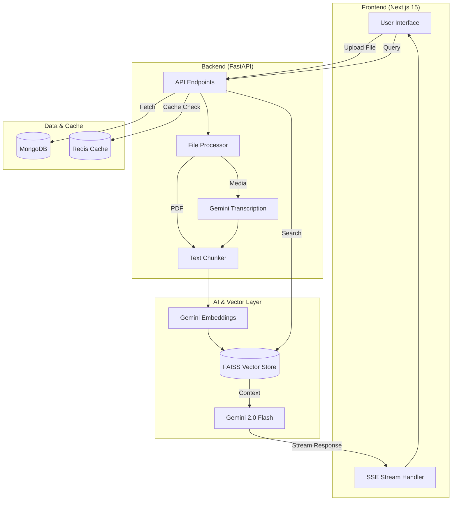

# InsightIQ: AI-Powered Document & Multimedia Intelligence

[](https://drive.google.com/file/d/1UyiULzrhFa_W0srPVUdxiNGmIiwwgsCD/view?usp=sharing)
[](https://github.com/hanikumar0/AI-Powered-Document-Multimedia-Q-A-Web-Application.git)

InsightIQ is a production-grade, full-stack AI platform that enables users to interact with PDFs, audio, and video files through a real-time conversational interface. Leveraging the power of **Google Gemini 2.0 Flash**, the application provides deep content analysis, automatic transcription, and semantic retrieval with high-fidelity citations.

---

---

## 📽️ Demo & Walkthrough

Experience InsightIQ in action! The following walkthrough demonstrates:
1. **Seamless PDF Interaction**: Asking deep technical questions about research papers.
2. **Video Intelligence**: Chatting with a video recording while it plays, with the AI identifying specific timestamps.
3. **Real-time Streaming**: Showing the fluid, instant response generation.

[**Watch the Full Walkthrough Here**](https://drive.google.com/file/d/1UyiULzrhFa_W0srPVUdxiNGmIiwwgsCD/view?usp=sharing)

---

## 🚀 Key Features

- **Real-Time AI Streaming**: Experience token-by-token responses for a fluid, ChatGPT-like interaction using Server-Sent Events (SSE).
- **Multimodal Intelligence**: 
  - **PDF Analysis**: Context-aware Q&A with precise page citations and semantic grounding.
  - **Multimedia Transcription**: Automatic high-fidelity transcription of audio and video files with segment-level retrieval.
  - **Timeline-Aware Chat**: Direct synchronization with media playback—ask about specific video moments.
- **Advanced RAG Engine**: Semantic search powered by **FAISS** (Facebook AI Similarity Search) and **Gemini Embeddings** for zero-hallucination responses.
- **High-Performance Infrastructure**:
  - **Redis Caching**: Intelligent layer caching for embeddings and transcriptions to drastically reduce API latency and costs.
  - **API Rate Limiting**: Production-grade security using `FastAPILimiter` to prevent system abuse.
- **Production-Ready UI**: A premium, dark-mode dashboard built with **Next.js 15**, **Tailwind CSS**, and **Framer Motion** for a sleek, responsive feel.
- **Robust Quality Assurance**: Mandatory **95%+ test coverage** enforced via automated CI/CD pipelines.

---

## 🛠️ Tech Stack

### Backend
- **Framework**: FastAPI (Python 3.13)
- **AI Core**: Google Gemini 2.0 Flash / Gemini-3-Flash
- **Database**: MongoDB (NoSQL)
- **Vector Store**: FAISS (Facebook AI Similarity Search)
- **Cache & Security**: Redis, FastAPILimiter
- **Task Processing**: Async Background Tasks

### Frontend
- **Framework**: Next.js 15 (App Router)
- **State Management**: Zustand
- **Styling**: Tailwind CSS, Framer Motion
- **Icons**: Lucide React

---

## 🏗️ Architecture

InsightIQ follows a modern Retrieval-Augmented Generation (RAG) architecture:



1. **Ingestion**: Files are processed (PDF OCR or Media Transcription) and chunked.
2. **Indexing**: Chunks are converted to embeddings via Gemini and stored in FAISS.
3. **Retrieval**: User queries trigger semantic searches to find relevant document context.
4. **Generation**: Gemini synthesizes an answer using the retrieved context, streaming it back to the UI in real-time.
5. **Caching**: Redis intercepts repeated requests for embeddings or transcripts to minimize latency and API costs.

---

## 📥 Setup & Installation

### Prerequisites
- **Docker & Docker Compose**
- **Google Gemini API Key** (Obtain from [Google AI Studio](https://aistudio.google.com/))

### Quick Start (Docker)

1. **Clone the repository**:
   ```bash
   git clone <repo-url>
   cd InsightIQ
   ```

2. **Configure Environment**:
   Create a `.env` file in the root directory (or copy from `backend/.env.example`):
   ```env
   GOOGLE_API_KEY=your_gemini_key_here
   MONGO_URL=mongodb://mongodb:27017
   REDIS_URL=redis://redis:6379/0
   JWT_SECRET_KEY=generate_a_secure_random_string
   ```

3. **Launch the platform**:
   ```bash
   docker-compose up --build
   ```

4. **Access the Application**:
   - **Frontend**: [http://localhost:3000](http://localhost:3000)
   - **Backend API**: [http://localhost:8000](http://localhost:8000)
   - **Swagger Documentation**: [http://localhost:8000/docs](http://localhost:8000/docs)

---

## 📖 API Documentation

InsightIQ provides a fully documented REST API.

### Core Endpoints
- **Authentication**: `POST /api/auth/register`, `POST /api/auth/login`
- **Upload**: `POST /api/upload` (Supports PDF, MP3, MP4, PNG, JPG)
- **Chat**: 
  - `POST /api/chat/message`: Standard Q&A
  - `POST /api/chat/message/stream`: Real-time streaming response (SSE)
- **Sessions**: `GET /api/chat/sessions`, `DELETE /api/chat/sessions/{id}`

For a complete interactive reference, visit the **Swagger UI** at `/docs` while the backend is running.

---

## 🧪 Testing & Quality Control

### Coverage Requirement
This project implements strict quality gates. **A minimum of 95% test coverage is required** for the build to pass.

### Running Tests Locally

#### Backend
```bash
cd backend
python -m pytest --cov=app --cov-report=term-missing tests/
```

#### Frontend
```bash
cd frontend
npm test -- --coverage
```

### CI/CD Pipeline
Every push to the main branch triggers an automated **GitHub Action** (`.github/workflows/test.yml`) that:
1. Installs all dependencies.
2. Runs static analysis and linting (`Black`, `Isort`, `Flake8`).
3. Executes the full test suite.
4. **Fails the build** if coverage is below 95%.

---

## 📂 Project Structure

```text
├── backend/
│   ├── app/                # Core application logic
│   │   ├── ai/             # Gemini integration & Transcription
│   │   ├── api/            # FastAPI routes
│   │   ├── rag/            # Vector store & Text chunking
│   │   └── services/       # Caching & Auth services
│   └── tests/              # Pytest suite (Unit & Integration)
├── frontend/
│   ├── src/
│   │   ├── components/     # UI components
│   │   ├── store/          # Zustand state management
│   │   └── services/       # API interaction layer
│   └── tests/              # Jest/React Testing Library suite
└── docker-compose.yml      # Multi-container orchestration
```

---

## 💡 Why Gemini?

InsightIQ was built using the **Google Gemini API** to provide an enterprise-grade experience with significant developer benefits:
- **Cost Efficiency**: Competitive pricing for long-context windows.
- **Generous Free Tier**: Ideal for development and educational assignments.
- **Multimodal Native**: Seamlessly handles text, audio, and video in a single unified model architecture.
